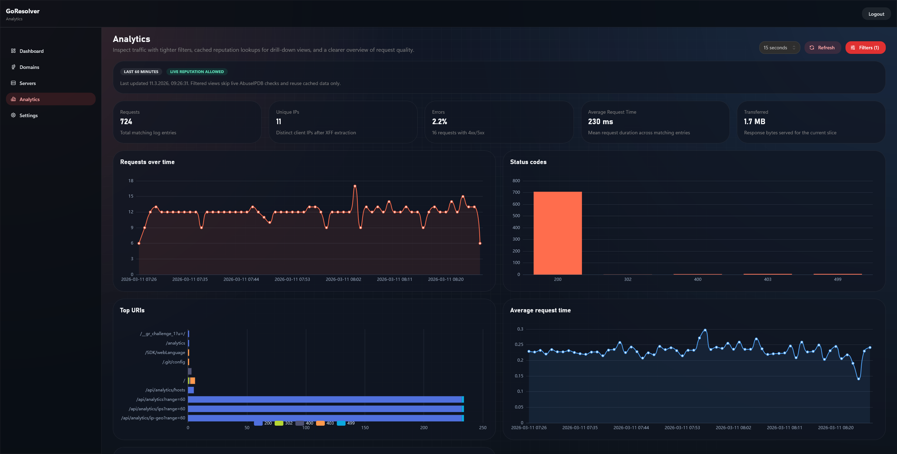
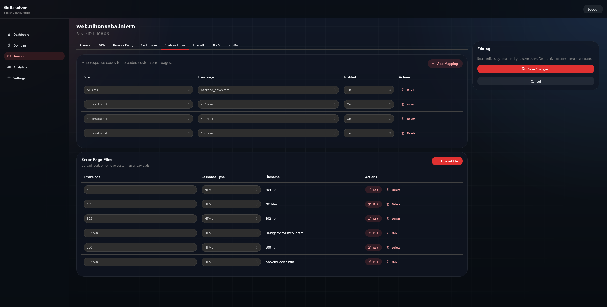
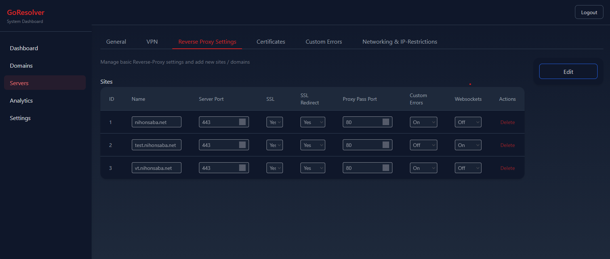
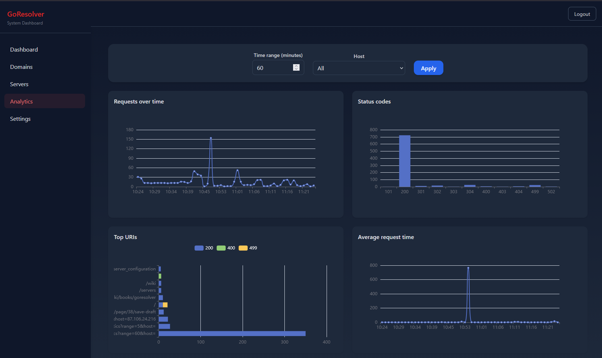
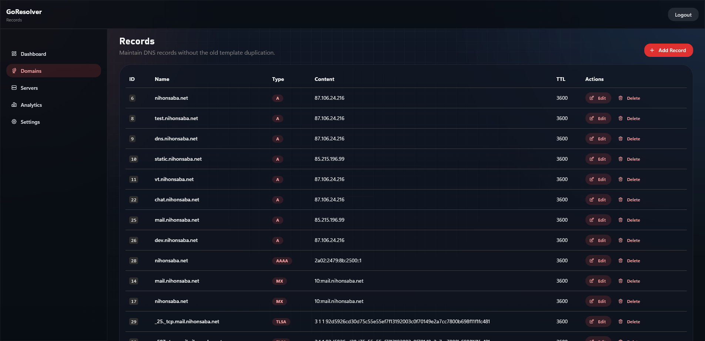
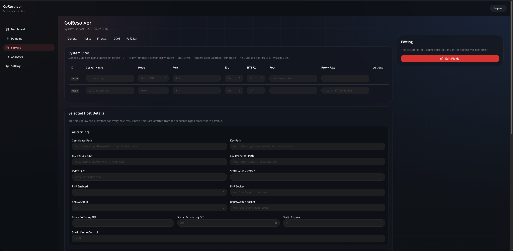

# GoResolver

## Project Overview

GoResolver is a self-hosted control panel for DNS, reverse proxying, VPN-connected backends, and traffic protection.
The goal is simple: manage network-facing services from one place without depending on a pile of external SaaS tools.

## Installation

### Quick start (Ubuntu/Debian/Fedora)

1. Set executable permissions:
   ```bash
   chmod +x scripts/install.sh
   ```
2. Run the installer:
   ```bash
   ./scripts/install.sh
   ```
3. Export the generated DB connection string:
   ```bash
   export DB_DSN='user:password@tcp(127.0.0.1:3306/goresolver)'
   ```
4. Start the server:
   ```bash
   ./bin/goresolver
   ```

The installer handles package installation, database/schema setup, admin user creation, and initial app settings.

## Screenshots

|                 |            |
|-----------------|------------|
|       |  |
|       |  | 
|       |  | 

## Key Features

- **Built-in authoritative DNS**
  - Manage domains and records (`A`, `AAAA`, `CNAME`, `MX`, `TXT`) directly in the panel.
  - Optional DNSSEC support for signed responses.
  - Benefit: no split workflow between app and external DNS tooling.

- **Reverse proxy management**
  - Per-site upstream routing, websocket support, SSL redirect, timeout controls.
  - Optional transparent proxy mode for preserving client source IP at L3.
  - Benefit: consistent Nginx behavior without hand-editing configs for every change.

- **Security controls per server**
  - DDoS policy controls: rate limits, connection limits, SYN controls, challenge mode, whitelist.
  - Fail2Ban-style automatic banning based on log patterns and status codes.
  - iptables tools for allow/block, DNAT/port forwarding, and other rule-level controls.
  - Benefit: practical edge protection tuned per backend, not one global setting.

- **Live analytics and traffic visibility**
  - Nginx JSON logs are ingested continuously.
  - Dashboards for request volume, status codes, top URIs, latency, IP reputation, and geo view.
  - Benefit: quicker troubleshooting during attacks and upstream failures.

- **Custom error handling**
  - Upload and map custom error pages by server/site/error code.
  - Inline editing support for stored error files.
  - Benefit: controlled fail behavior instead of raw upstream/Nginx default errors.

- **Certificate lifecycle management**
  - Issue, renew, and remove TLS certificates from the UI (ACME/Let’s Encrypt flow).
  - Benefit: centralized SSL operations across services.

- **VPN-backed server onboarding**
  - Generate OpenVPN client profiles and assign static VPN-side IPs.
  - Benefit: cleaner private backend connectivity and simpler server rollout.
